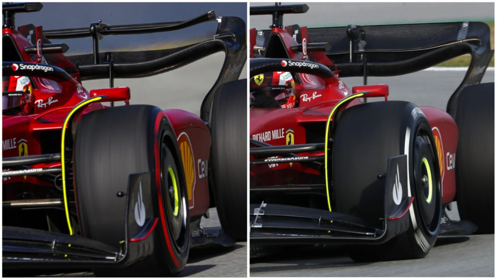

```{r setup, include=FALSE}

knitr::opts_chunk$set(echo = FALSE, message = FALSE, warning = FALSE)

library(dplyr)
library(stringr)
library(tidyverse)
library(ggplot2)
library(gridExtra)
library(ggthemes)
library(patchwork) 
library(grid)
library(ggrepel)
library(forcats)
library(RColorBrewer)
library(viridis)


source("ProgettoDRS.R")

```

```{=html}
<style>
div.blue pre { background-color:#B6DBE8; }
div.blue pre.r { background-color:black; }
</style>
```
```{=html}
<style type="text/css">
body{
  font-family: Helvetica;
  font-size: 16pt;
}
h1{
  margin-top:0px;
  margin-bottom:0px;
  font-weight: bold;
  font-size: 35pt;
  line-height: 40px; 
  color: #2D4EBF;
  
}
h2{
  margin-top:0px;
  margin-bottom:0px;
  font-size: 30pt;
  line-height: 38px; 
  color:#424E76;
}
h3{
  margin:0px;
  font-size: 25pt;
}
h4,h5,h6{
  font-size: 15pt;
}
</style>

```


## Le domande che mi sono posto:

-   Il DRS è stato aggiunto in F1 nel 2011, ma la sua introduzione che cambiamenti ha portato?
-   Quali sono i circuiti e le stagioni con più sorpassi?
-   Nel 2022, rispetto al 2011, i sorpassi sono aumentati?
-   Qual'è il pilota che ha effettuato più sorpassi e quello che ne ha subiti di più?
-   Come mai nel 2022 in Ungheria ci sono stati così tanti sorpassi rispetto all'anno prima?


## Cos'è il DRS?

**Drag reduption system**

```{r, DRS, echo=FALSE, dpi=200,out.width = '100%'}



```


## Utilizzo del DRS:
 
### Quando si può attivare?

-   È attivabile dal pilota sono nelle zone predisposte della pista (rettilinei).
-   Se il pilota che sta attaccando è a meno di 1 secondo da quello che lo precede.

### Quando non si può attivare?

-   Nei primi 2 giri di gara o dopo le ripartenze da red flag o da safety car.
-   Se le condizioni della pista non sono sicure (a discrezione dei direttori di gara).


## Com'è stato l'andamento dei sorpassi negli ultimi anni nei vari circuiti?

```{r, echo=FALSE, out.width = '100%'}

plot(Print1) 

```


## Analisi:

-   In generale si vede che, a parte in qualche singolo anno, con il passare del tempo il numero dei sorpassi rimane sempre all'interno di un certo range.

-   Il fatto che ci sia una grande distanza tra alcuni dati può essere dovuta da più fattori:

    -   Cambio totale di circuito, o cambio di alcune curve (es. il GP d'Europa si è disputato per degli anni al Nürburgring e per            altri a Valencia)
    -   Cambio di regolamentazione (es. DRS)
    -   Le condizioni meteorologiche (con la pioggia c'è un asfato scivoloso e meno visibilità)
    -   Safety car e incidenti (in questi giri le posizioni rimangono uguali senza sorpassi)


##  È aumentato il numero di sorpassi con l'aggiunta del DRS?

```{r, out.width="100%"}

Print2

```


## Analisi:

Media dei sorpassi i 10 anni prima dell'aggiunta del DRS:

::: blue
```{r}

round( mean(GeneralMeanB$SumOvertake), digits = 1)

```
:::

Media dei sorpassi i 10 anni dopo dell'aggiunta del DRS:

::: blue
```{r}

round( mean(GeneralMeanA$SumOvertake), digits = 1)

```
:::

Da un analisi generale, si può dire che il numero dei sorpassi è più che raddoppiato grazie al DRS.

Però in 20 anni ci sono molte altre variabili da considerare: le auto e il regolamento sono cambiati. Quindi avrebbe più senso un analisi sui 5 anni prima e dopo la sua introduzione.


## È aumentato il numero di sorpassi con l'aggiunta del DRS?
 
```{r, out.width="100%"}

Print3

```


## Analisi:

Media dei sorpassi i 5 anni prima dell'aggiunta del DRS:

::: blue
```{r}

round( mean(GeneralMeanB5$SumOvertake), digits = 1)

```
:::

Media dei sorpassi i 5 anni dopo dell'aggiunta del DRS:

::: blue
```{r}

round( mean(GeneralMeanA5$SumOvertake), digits = 1)

```
:::

Anche in questo caso la media è circa raddoppiata, quindi si può dire che l'avvento del DRS ha portato un forte aumento dei sorpassi.


## Qual'è il circuito dov'è più facile sorpassare?

```{r, out.width="100%"}

Print4

```

## Analizzando i circuiti con meno sorpassi:
 

```{r, out.width="100%"}

Print12

```

## Analisi:

Aumento dei sorpassi nel GP di Monaco:

::: blue
```{r}
paste("10 anni: ", round((( mean(MonacoMean2$SumOvertake) - mean(MonacoMean1$SumOvertake) )/mean(MonacoMean1$SumOvertake) )*100, digits = 1),"%")
paste("20 anni: ", round((( mean(MonacoMean4$SumOvertake) - mean(MonacoMean3$SumOvertake) )/mean(MonacoMean3$SumOvertake) )*100, digits = 1), "%")
```
:::

Aumento dei sorpassi nel GP di Ungheria:

::: blue
```{r}

paste("10 anni: ", round((( mean(HungaryMean2$SumOvertake) - mean(HungaryMean1$SumOvertake) )/mean(HungaryMean1$SumOvertake) )*100, digits = 1),"%")

paste("20 anni: ", round((( mean(HungaryMean4$SumOvertake) - mean(HungaryMean3$SumOvertake) )/mean(HungaryMean3$SumOvertake) )*100, digits = 1), "%") 

```
:::

Il numero dei sorpassi in questi circuiti quindi dipende dalle condizioni intrinseche della pista: a Monaco la larghezza della carreggiata rimane sempre uguale e le auto negli anni si solo allargate portando quindi una diminuzione di sorpasi.


## Analizzando i circuiti con più sorpassi:

```{r, out.width="100%"}

Print13

```
(In entrambi i circuiti il GP è iniziato solo nel 2004 quindi i 20 anni non sono visibili)


## Analisi:

Aumento dei sorpassi nel GP di Cina:

::: blue
```{r}
paste("10 anni: ", round((( mean(ChinaMean2$SumOvertake) - mean(ChinaMean1$SumOvertake) )/mean(ChinaMean1$SumOvertake) )*100, digits = 1),"%")
paste("14 anni: ", round((( mean(ChinaMean4$SumOvertake) - mean(ChinaMean3$SumOvertake) )/mean(ChinaMean3$SumOvertake) )*100, digits = 1), "%")
```
:::

Aumento dei sorpassi nel GP di Bahrain:

::: blue
```{r}

paste("10 anni: ", round((( mean(Bahrain2$SumOvertake) - mean(Bahrain1$SumOvertake) )/mean(Bahrain1$SumOvertake) )*100, digits = 1),"%")

paste("14 anni: ", round((( mean(Bahrain4$SumOvertake) - mean(Bahrain3$SumOvertake) )/mean(Bahrain3$SumOvertake) )*100, digits = 1), "%") 
```
:::

Si vede che l'avvento del DRS nei circuiti con molti sorpassi, ne ha aumentato ancora di più il numero.


## Oggi ci sono più sorpassi di una volta?
 
```{r, out.width="100%"}

Print11

```


## Qual'è la stagione con più sorpassi?

```{r, out.width="100%"}

Print15

```


## Analisi:

-   La media dei sorpassi stagionali dei primi tre anni è:
    -   2011 = 67.8
    -   2012 = 62.8
    -   2013 = 54.0
-   Questi dati confermano la tesi che il DRS ha aumentato il numero dei sorpassi, infatti sono i 3 anni successivi alla sua introduzione.
-   Inoltre si vede che tutte le stagioni (a parte il 2017) dall'introduzione del DRS, nel grafico vengono prima delle altre.


## Qual'è il pilota che ha fatto più sorpassi?

```{r, out.width="100%"}

Print16

```


## Qual'è il pilota che ha subito più sorpassi?

```{r, out.width="100%"}

Print17

```


## Qual'è il pilota più forte a difendersi?

```{r, out.width="100%"}

Print18

```


## Analisi:

Si vede che ci sono dei piloti (es. Perez e Alonso) che sono in cima alla classifica sia dei sorpassi eseguiti che dei sorpassi subiti, questo perchè sono piloti di metà griglia, quindi competono con più piloti e scuderie (più possibilità di fare e subire sorpassi).

I piloti che hanno la percentiale più bassa invece è perchè probabilmente sono stati più volte in testa e quindi avevano meno probabilità di essere passati o comunque competevano con meno piloti. 


## Nel GP d'Ungheria nel 2022, ci sono stati più sorpassi del 2021?

```{r, out.width="100%"}

Print22

```


## Dove sono stati fatti questi sorpassi?

```{r, out.width="100%"}

Print23

```

(Non tutti i sorpassi sono indicizzati ad una curva perchè non sono stati mostrati nella diretta)


## Analisi:

Se togliamo i sorpassi "sconosciuti", si vede che le curve in cui sono stati effettuati più sorpassi sono la 1,2,3,4.

```{r, out.width = '70%'}

knitr::include_graphics("Circuito Ungheria.png")

```

Si può dire che questi sorpassi siano stati effettuati grazie al doppio rettilineo (con DRS), le auto del 2022 infatti sono state progettate per riusire a stare meglio in scia all\`auto davanti.


## Conclusioni

L'avvento del DRS in F1 ha portato un aumento dei sorpassi, è chiaro, ma ci sono da considerare anche i progressi tecnologici e i nuovi regolamenti: come si è visto dall'ultimo grafico, le innovazioni radicali sulle auto portano grandi cambiamenti in pista, e in questo caso sui sorpassi.

Inoltre in alcuni circuiti dove le condizioni intrinseche del circuito non permettono i sorpassi, tipo Monaco, l'avvento del DRS o delle nuove invenzioni non è scontato che portino cambiamenti estremi come avviene invece in altre piste.

Nel campo dei sorpassi però il DRS è sicuramente l'invenzione che ha portato più innovazione negli ultimi anni e forse ad oggi nel 2022, siamo iniziando a vivere la prossima...


# Fine
